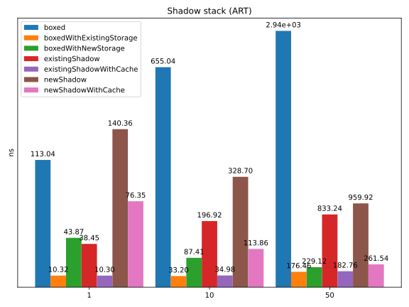
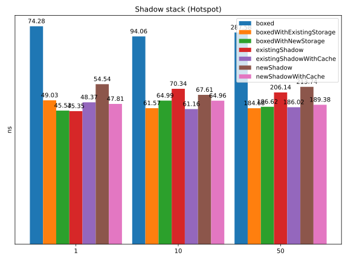
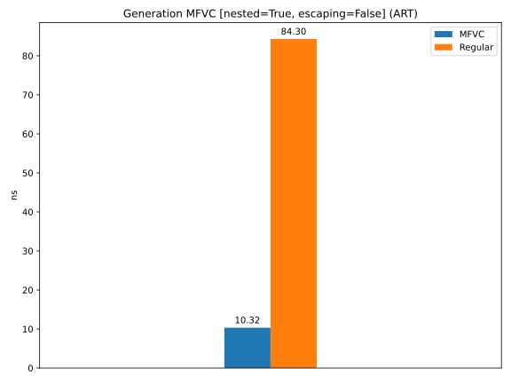
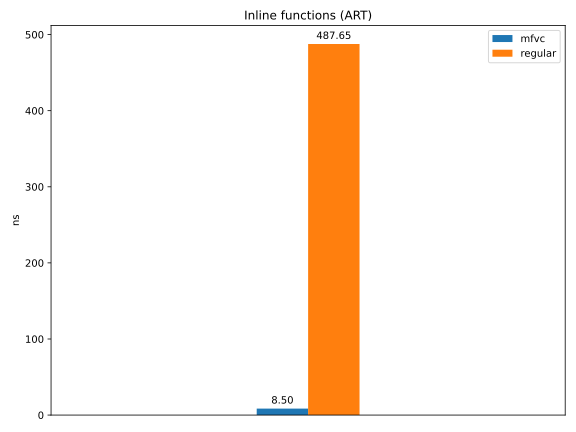
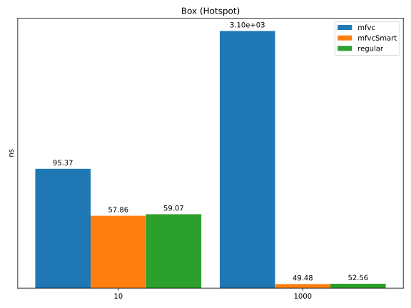

# Shadow stack

Shadow stack is one of the workarounds to overcome inability to return multiple values unboxed in JVM.
* It can be applied to any function, not only inline. Even to recursive functions.
* It is either non-threadsafe but fast or inefficient but thread-safe.

Exclusive guaranty cannot be verified by compiler because the shadow stack is just a regular object, while locks may be very expensive.
However, this guaranty can be provided by user so such approach may be useful.

This benchmark compares shadow stack-based function returns to box-based ones.

## ART
| Size | Type | Time |
| ---: | :---: | :--- |
| 1 | Boxed | 113.04 ± 26.47 ns |
| 1 | BoxedWithExistingStorage | 10.32 ± 15.35 ns (9% of boxed) |
| 1 | BoxedWithNewStorage | 43.87 ± 32.98 ns (39% of boxed) |
| 1 | ExistingShadow | 38.45 ± 17.02 ns (34% of boxed) |
| 1 | ExistingShadowWithCache | 10.30 ± 18.88 ns (9% of boxed) |
| 1 | NewShadow | 140.36 ± 23.55 ns (124% of boxed) |
| 1 | NewShadowWithCache | 76.35 ± 53.06 ns (68% of boxed) |
| 10 | Boxed | 655.04 ± 46.86 ns |
| 10 | BoxedWithExistingStorage | 33.20 ± 23.44 ns (5% of boxed) |
| 10 | BoxedWithNewStorage | 87.41 ± 19.73 ns (13% of boxed) |
| 10 | ExistingShadow | 196.92 ± 16.72 ns (30% of boxed) |
| 10 | ExistingShadowWithCache | 34.98 ± 25.93 ns (5% of boxed) |
| 10 | NewShadow | 328.70 ± 57.28 ns (50% of boxed) |
| 10 | NewShadowWithCache | 113.86 ± 26.65 ns (17% of boxed) |
| 50 | Boxed | 2.94 ± 0.09 mcs |
| 50 | BoxedWithExistingStorage | 176.46 ± 17.65 ns (6% of boxed) |
| 50 | BoxedWithNewStorage | 229.12 ± 28.75 ns (8% of boxed) |
| 50 | ExistingShadow | 833.24 ± 37.04 ns (28% of boxed) |
| 50 | ExistingShadowWithCache | 182.76 ± 18.56 ns (6% of boxed) |
| 50 | NewShadow | 959.92 ± 64.49 ns (33% of boxed) |
| 50 | NewShadowWithCache | 261.54 ± 30.95 ns (9% of boxed) |

## Hotspot
| Size | Type | Time |
| ---: | :---: | :--- |
| 1 | Boxed | 74.28 ± 1.12 ns |
| 1 | BoxedWithExistingStorage | 49.03 ± 0.36 ns (66% of boxed) |
| 1 | BoxedWithNewStorage | 45.53 ± 0.91 ns (61% of boxed) |
| 1 | ExistingShadow | 45.35 ± 0.25 ns (61% of boxed) |
| 1 | ExistingShadowWithCache | 48.37 ± 0.32 ns (65% of boxed) |
| 1 | NewShadow | 54.54 ± 0.89 ns (73% of boxed) |
| 1 | NewShadowWithCache | 47.81 ± 0.64 ns (64% of boxed) |
| 10 | Boxed | 94.06 ± 1.77 ns |
| 10 | BoxedWithExistingStorage | 61.57 ± 0.32 ns (65% of boxed) |
| 10 | BoxedWithNewStorage | 64.99 ± 0.79 ns (69% of boxed) |
| 10 | ExistingShadow | 70.34 ± 0.37 ns (75% of boxed) |
| 10 | ExistingShadowWithCache | 61.16 ± 0.32 ns (65% of boxed) |
| 10 | NewShadow | 67.61 ± 0.67 ns (72% of boxed) |
| 10 | NewShadowWithCache | 64.96 ± 0.90 ns (69% of boxed) |
| 50 | Boxed | 287.58 ± 3.67 ns |
| 50 | BoxedWithExistingStorage | 184.68 ± 0.51 ns (64% of boxed) |
| 50 | BoxedWithNewStorage | 186.62 ± 0.81 ns (65% of boxed) |
| 50 | ExistingShadow | 206.14 ± 0.46 ns (72% of boxed) |
| 50 | ExistingShadowWithCache | 186.02 ± 0.96 ns (65% of boxed) |
| 50 | NewShadow | 213.74 ± 1.30 ns (74% of boxed) |
| 50 | NewShadowWithCache | 189.38 ± 1.02 ns (66% of boxed) |

# Generation of MFVC

These benchmarks check generation speed of instances of 2D double points:
* Nested points store not-nested inside.
* Escaping tests let the generated point to escape from function scope to check breakage of Scalar replacement optimization.

## ART
| Escaping | Nested | Type | Time |
| :---: | :---: | :---: | :--- |
| ✗ | ✗ | Regular | 46.47 ± 39.80 ns |
| ✗ | ✗ | MFVC | 10.32 ± 21.94 ns (22% of regular) |
| ✗ | ✓ | Regular | 84.30 ± 42.96 ns |
| ✗ | ✓ | MFVC | 10.32 ± 36.26 ns (22% of regular) |
| ✓ | ✗ | Regular | 48.27 ± 37.55 ns |
| ✓ | ✗ | MFVC | 9.60 ± 44.69 ns (21% of regular) |
| ✓ | ✓ | Regular | 85.10 ± 43.07 ns |
| ✓ | ✓ | MFVC | 9.52 ± 61.05 ns (20% of regular) |

<table style="border: none; border-collapse: collapse;">
<tr style="border: none;"> <td style="border: none; padding: 0;"></td><td style="border: none; padding: 0;"></td>
<tr style="border: none;"> <td style="border: none; padding: 0;"></td><td style="border: none; padding: 0;"></td>
</table>

## Hotspot
| Escaping | Nested | Type | Time |
| :---: | :---: | :---: | :--- |
| ✗ | ✗ | Regular | 58.35 ± 2.59 ns |
| ✗ | ✗ | Mfvc | 59.40 ± 2.44 ns (102% of regular) |
| ✗ | ✓ | Regular | 68.06 ± 2.88 ns |
| ✗ | ✓ | Mfvc | 57.44 ± 2.35 ns (98% of regular) |
| ✓ | ✗ | Regular | 62.53 ± 1.87 ns |
| ✓ | ✗ | Mfvc | 60.20 ± 2.42 ns (103% of regular) |
| ✓ | ✓ | Regular | 66.82 ± 2.13 ns |
| ✓ | ✓ | Mfvc | 62.10 ± 2.70 ns (106% of regular) |

<table style="border: none; border-collapse: collapse;">
<tr style="border: none;"> <td style="border: none; padding: 0;"></td><td style="border: none; padding: 0;"></td>
<tr style="border: none;"> <td style="border: none; padding: 0;"></td><td style="border: none; padding: 0;"></td>
</table>

# Complex usage of MFVC

These tests perform calculating of Collatz sequence for 2D points as it can not be optimized by the compiler and runtime because there is no known proof that its ends with 1.

Nested points store not-nested inside.

## ART
| Nested | Size | Type | Time |
| :---: | ---: | :---: | :--- |
| ✗ | 10 | Regular | 692.48 ± 58.96 ns |
| ✗ | 10 | MFVC | 414.35 ± 2.98 ns (60% of regular) |
| ✗ | 100 | Regular | 3.26 ± 0.07 mcs |
| ✗ | 100 | MFVC | 1.79 ± 0.01 mcs (55% of regular) |
| ✗ | 1000 | Regular | 30.28 ± 0.63 mcs |
| ✗ | 1000 | MFVC | 13.82 ± 0.25 mcs (46% of regular) |
| ✓ | 10 | Regular | 1.66 ± 0.09 mcs |
| ✓ | 10 | MFVC | 335.48 ± 3.16 ns (20% of regular) |
| ✓ | 100 | Regular | 4.43 ± 0.11 mcs |
| ✓ | 100 | MFVC | 1.79 ± 0.01 mcs (40% of regular) |
| ✓ | 1000 | Regular | 25.07 ± 0.74 mcs |
| ✓ | 1000 | MFVC | 16.42 ± 0.39 mcs (66% of regular) |

<table style="border: none; border-collapse: collapse;">
<tr style="border: none;"> <td style="border: none; padding: 0;"></td><td style="border: none; padding: 0;"></td>
</table>

## Hotspot
| Nested | Size | Type | Time |
| :---: | ---: | :---: | :--- |
| ✗ | 10 | Regular | 168.37 ± 7.74 ns |
| ✗ | 10 | Mfvc | 139.48 ± 4.33 ns (83% of regular) |
| ✗ | 1000 | Regular | 3.17 ± 0.04 mcs |
| ✗ | 1000 | Mfvc | 2.85 ± 0.01 mcs (90% of regular) |
| ✗ | 100000 | Regular | 3.59 ± 0.04 mcs |
| ✗ | 100000 | Mfvc | 3.42 ± 0.01 mcs (95% of regular) |
| ✓ | 10 | Regular | 202.47 ± 21.67 ns |
| ✓ | 10 | Mfvc | 136.25 ± 3.18 ns (67% of regular) |
| ✓ | 1000 | Regular | 3.26 ± 0.05 mcs |
| ✓ | 1000 | Mfvc | 2.87 ± 0.02 mcs (88% of regular) |
| ✓ | 100000 | Regular | 3.62 ± 0.03 mcs |
| ✓ | 100000 | Mfvc | 3.35 ± 0.01 mcs (92% of regular) |

<table style="border: none; border-collapse: collapse;">
<tr style="border: none;"> <td style="border: none; padding: 0;"></td><td style="border: none; padding: 0;"></td>
</table>

# Usage of inline functions returning MFVC

Returning from inline function can be done without boxing because inline function reuses callee's stackframe and its local variables. It can successfully pass the result with them.

## ART
| Type | Time |
| :---: | :--- |
| Regular | 487.65 ± 274.42 ns |
| Mfvc | 8.50 ± 3.01 ns (2% of regular) |

## Hotspot
| Type | Time |
| :---: | :--- |
| Regular | 59.78 ± 1.77 ns |
| Mfvc | 65.03 ± 5.75 ns (109% of regular) |

# Box usage

Regular classes have to be boxed, but they do it once and never rebox. MFVC are not boxed by default but there are limitations that make them box. However, each time, the same MFVC needs to become boxed, it creates a new box. So, it is better to preserve box when it is possible. To do this, we may store and reuse boxed instances (if they were received) for each MFVC and its MFVC subnodes and pass them as parameters. This doesn't solve the problem when it is necessary to send a callee received box, but it helps in all other cases and reduces the problem.

 These benchmarks show the problem and the solution.

## ART
| Size | Type | Time |
| ---: | :---: | :--- |
| 100 | Regular | 591.79 ± 21.65 ns |
| 100 | Mfvc | 4.84 ± 0.23 mcs (818% of regular) |
| 100 | MfvcSmart | 481.09 ± 24.83 ns (81% of regular) |

## Hotspot
| Size | Type | Time |
| ---: | :---: | :--- |
| 10 | Regular | 59.07 ± 8.86 ns |
| 10 | Mfvc | 95.37 ± 5.54 ns (161% of regular) |
| 10 | MfvcSmart | 57.86 ± 6.42 ns (98% of regular) |
| 1000 | Regular | 52.56 ± 5.32 ns |
| 1000 | Mfvc | 3.10 ± 0.07 mcs (5904% of regular) |
| 1000 | MfvcSmart | 49.48 ± 1.44 ns (94% of regular) |

# VArrays

These tests compare different implementations of VArrays with MFVC (2D double points and 3D double points) inside:
* Regular: regular arrays `Array<Point>` which box their argument.
* Dense: point is stored in a single double array where coordinates are stored sequentially. Such storage is cache-friendly and boxing-free.
* Sparse: each coordinate is stored in its own array. This may be caused by different MFVC field types: they cannot be stored in the same array. This is less cache-friendly but still without boxing.

## ART
### Generation
| Dimension | Size | Type | Time |
| :---: | ---: | :---: | :--- |
| 2D | 10 | Regular | 1.24 ± 0.07 mcs |
| 2D | 10 | Dense | 365.88 ± 19.98 ns (29% of regular) |
| 2D | 10 | Sparse | 422.81 ± 39.56 ns (34% of regular) |
| 2D | 1000 | Regular | 97.42 ± 1.26 mcs |
| 2D | 1000 | Dense | 32.75 ± 1.39 mcs (34% of regular) |
| 2D | 1000 | Sparse | 17.15 ± 0.50 mcs (18% of regular) |
| 2D | 100000 | Regular | 10.50 ± 0.38 ms |
| 2D | 100000 | Dense | 2.11 ± 0.15 ms (20% of regular) |
| 2D | 100000 | Sparse | 2.47 ± 0.12 ms (24% of regular) |
| 3D | 10 | Regular | 1.27 ± 0.06 mcs |
| 3D | 10 | Dense | 479.21 ± 40.27 ns (38% of regular) |
| 3D | 10 | Sparse | 558.50 ± 35.19 ns (44% of regular) |
| 3D | 1000 | Regular | 124.14 ± 1.84 mcs |
| 3D | 1000 | Dense | 44.09 ± 1.50 mcs (36% of regular) |
| 3D | 1000 | Sparse | 46.09 ± 0.91 mcs (37% of regular) |
| 3D | 100000 | Regular | 11.60 ± 0.29 ms |
| 3D | 100000 | Dense | 3.79 ± 0.18 ms (33% of regular) |
| 3D | 100000 | Sparse | 3.63 ± 0.15 ms (31% of regular) |

<table style="border: none; border-collapse: collapse;">
<tr style="border: none;"> <td style="border: none; padding: 0;"></td><td style="border: none; padding: 0;"></td>
</table>

### RandomAccess
| Dimension | Size | Type | Time |
| :---: | ---: | :---: | :--- |
| 2D | 10 | Regular | 228.11 ± 15.08 ns |
| 2D | 10 | Dense | 130.57 ± 0.68 ns (57% of regular) |
| 2D | 10 | Sparse | 126.90 ± 0.58 ns (56% of regular) |
| 2D | 1000 | Regular | 4.58 ± 0.06 mcs |
| 2D | 1000 | Dense | 11.89 ± 0.06 mcs (260% of regular) |
| 2D | 1000 | Sparse | 4.25 ± 0.01 mcs (93% of regular) |
| 2D | 100000 | Regular | 6.94 ± 0.54 ms |
| 2D | 100000 | Dense | 1.28 ± 0.02 ms (18% of regular) |
| 2D | 100000 | Sparse | 2.82 ± 0.19 ms (41% of regular) |
| 3D | 10 | Regular | 127.03 ± 0.39 ns |
| 3D | 10 | Dense | 141.87 ± 2.03 ns (112% of regular) |
| 3D | 10 | Sparse | 126.66 ± 6.04 ns (100% of regular) |
| 3D | 1000 | Regular | 4.91 ± 0.06 mcs |
| 3D | 1000 | Dense | 4.25 ± 0.01 mcs (87% of regular) |
| 3D | 1000 | Sparse | 11.22 ± 0.02 mcs (228% of regular) |
| 3D | 100000 | Regular | 20.23 ± 0.33 ms |
| 3D | 100000 | Dense | 6.08 ± 0.18 ms (30% of regular) |
| 3D | 100000 | Sparse | 5.35 ± 0.24 ms (26% of regular) |

<table style="border: none; border-collapse: collapse;">
<tr style="border: none;"> <td style="border: none; padding: 0;"></td><td style="border: none; padding: 0;"></td>
</table>

### SequentialAccess
| Dimension | Size | Type | Time |
| :---: | ---: | :---: | :--- |
| 2D | 10 | Regular | 207.29 ± 0.89 ns |
| 2D | 10 | Dense | 85.95 ± 3.48 ns (41% of regular) |
| 2D | 10 | Sparse | 85.19 ± 1.16 ns (41% of regular) |
| 2D | 1000 | Regular | 3.34 ± 0.01 mcs |
| 2D | 1000 | Dense | 10.38 ± 0.05 mcs (311% of regular) |
| 2D | 1000 | Sparse | 6.04 ± 1.00 ns (0% of regular) |
| 2D | 100000 | Regular | 794.85 ± 7.06 mcs |
| 2D | 100000 | Dense | 427.88 ± 0.78 mcs (54% of regular) |
| 2D | 100000 | Sparse | 1.01 ± 0.01 ms (127% of regular) |
| 3D | 10 | Regular | 86.07 ± 0.95 ns |
| 3D | 10 | Dense | 96.52 ± 4.22 ns (112% of regular) |
| 3D | 10 | Sparse | 106.45 ± 2.71 ns (124% of regular) |
| 3D | 1000 | Regular | 23.47 ± 0.26 mcs |
| 3D | 1000 | Dense | 12.19 ± 0.10 mcs (52% of regular) |
| 3D | 1000 | Sparse | 9.71 ± 0.02 mcs (41% of regular) |
| 3D | 100000 | Regular | 805.25 ± 4.48 mcs |
| 3D | 100000 | Dense | 863.35 ± 5.63 mcs (107% of regular) |
| 3D | 100000 | Sparse | 1.18 ± 0.01 ms (146% of regular) |

<table style="border: none; border-collapse: collapse;">
<tr style="border: none;"> <td style="border: none; padding: 0;"></td><td style="border: none; padding: 0;"></td>
</table>

## Hotspot
### Generate
| Dimension | Size | Type | Time |
| :---: | ---: | :---: | :--- |
| 2D | 10 | Regular | 92.65 ± 7.49 ns |
| 2D | 10 | Dense | 73.24 ± 2.36 ns (79% of regular) |
| 2D | 10 | Sparse | 71.98 ± 6.63 ns (78% of regular) |
| 2D | 1000 | Regular | 3.02 ± 0.07 mcs |
| 2D | 1000 | Dense | 1.31 ± 0.04 mcs (43% of regular) |
| 2D | 1000 | Sparse | 1.22 ± 0.03 mcs (40% of regular) |
| 2D | 100000 | Regular | 288.84 ± 1.99 mcs |
| 2D | 100000 | Dense | 92.14 ± 0.51 mcs (32% of regular) |
| 2D | 100000 | Sparse | 110.73 ± 0.66 mcs (38% of regular) |
| 3D | 10 | Regular | 89.59 ± 10.02 ns |
| 3D | 10 | Dense | 99.65 ± 3.65 ns (111% of regular) |
| 3D | 10 | Sparse | 91.23 ± 10.98 ns (102% of regular) |
| 3D | 1000 | Regular | 2.98 ± 0.07 mcs |
| 3D | 1000 | Dense | 2.22 ± 0.04 mcs (74% of regular) |
| 3D | 1000 | Sparse | 1.89 ± 0.05 mcs (63% of regular) |
| 3D | 100000 | Regular | 290.73 ± 2.22 mcs |
| 3D | 100000 | Dense | 182.31 ± 0.99 mcs (63% of regular) |
| 3D | 100000 | Sparse | 161.32 ± 0.98 mcs (55% of regular) |

<table style="border: none; border-collapse: collapse;">
<tr style="border: none;"> <td style="border: none; padding: 0;"></td><td style="border: none; padding: 0;"></td>
</table>

### RandomAccessRead
| Dimension | Size | Type | Time |
| :---: | ---: | :---: | :--- |
| 2D | 10 | Regular | 73.04 ± 2.49 ns |
| 2D | 10 | Dense | 80.14 ± 3.04 ns (110% of regular) |
| 2D | 10 | Sparse | 69.39 ± 2.22 ns (95% of regular) |
| 2D | 1000 | Regular | 1.36 ± 0.01 mcs |
| 2D | 1000 | Dense | 1.30 ± 0.01 mcs (96% of regular) |
| 2D | 1000 | Sparse | 1.03 ± 0.01 mcs (75% of regular) |
| 2D | 100000 | Regular | 423.87 ± 0.96 mcs |
| 2D | 100000 | Dense | 209.45 ± 0.37 mcs (49% of regular) |
| 2D | 100000 | Sparse | 230.58 ± 0.43 mcs (54% of regular) |
| 3D | 10 | Regular | 92.50 ± 3.53 ns |
| 3D | 10 | Dense | 85.89 ± 3.17 ns (93% of regular) |
| 3D | 10 | Sparse | 78.61 ± 2.77 ns (85% of regular) |
| 3D | 1000 | Regular | 1.86 ± 0.01 mcs |
| 3D | 1000 | Dense | 1.89 ± 0.01 mcs (102% of regular) |
| 3D | 1000 | Sparse | 1.51 ± 0.01 mcs (81% of regular) |
| 3D | 100000 | Regular | 572.54 ± 1.46 mcs |
| 3D | 100000 | Dense | 316.21 ± 0.84 mcs (55% of regular) |
| 3D | 100000 | Sparse | 361.51 ± 0.77 mcs (63% of regular) |

<table style="border: none; border-collapse: collapse;">
<tr style="border: none;"> <td style="border: none; padding: 0;"></td><td style="border: none; padding: 0;"></td>
</table>

### SequentialRead
| Dimension | Size | Type | Time |
| :---: | ---: | :---: | :--- |
| 2D | 10 | Regular | 66.27 ± 2.64 ns |
| 2D | 10 | Dense | 67.63 ± 2.24 ns (102% of regular) |
| 2D | 10 | Sparse | 62.73 ± 1.98 ns (95% of regular) |
| 2D | 1000 | Regular | 523.87 ± 4.56 ns |
| 2D | 1000 | Dense | 1.19 ± 0.01 mcs (228% of regular) |
| 2D | 1000 | Sparse | 1.01 ± 0.01 mcs (193% of regular) |
| 2D | 100000 | Regular | 73.82 ± 0.10 mcs |
| 2D | 100000 | Dense | 113.34 ± 0.15 mcs (154% of regular) |
| 2D | 100000 | Sparse | 84.19 ± 0.11 mcs (114% of regular) |
| 3D | 10 | Regular | 69.82 ± 4.42 ns |
| 3D | 10 | Dense | 82.94 ± 2.70 ns (119% of regular) |
| 3D | 10 | Sparse | 79.50 ± 2.90 ns (114% of regular) |
| 3D | 1000 | Regular | 643.65 ± 5.51 ns |
| 3D | 1000 | Dense | 2.19 ± 0.01 mcs (340% of regular) |
| 3D | 1000 | Sparse | 1.40 ± 0.01 mcs (218% of regular) |
| 3D | 100000 | Regular | 81.78 ± 0.12 mcs |
| 3D | 100000 | Dense | 191.28 ± 0.37 mcs (234% of regular) |
| 3D | 100000 | Sparse | 141.68 ± 0.19 mcs (173% of regular) |

<table style="border: none; border-collapse: collapse;">
<tr style="border: none;"> <td style="border: none; padding: 0;"></td><td style="border: none; padding: 0;"></td>
</table>

